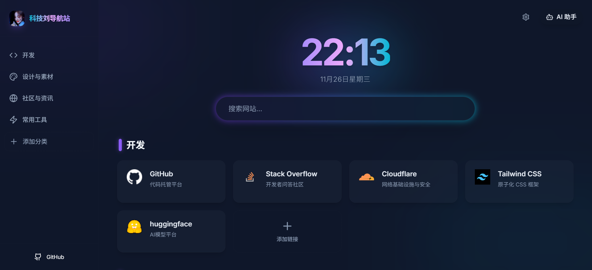

# 导航站
## 基于 Gemini 3 Pro开发的导航站，项目在持续开发中…

<p align="center">
  
</p>

<div align="center">

</div>

# 预览

<div align="center">

</div>

# 部署说明

## Cloudflare Pages（含 KV）

1. **Fork 该项目**
2. **在 Cloudflare Pages 创建项目**
   - 访问 [Cloudflare Pages](https://pages.cloudflare.com/)
   - 连接 GitHub 仓库
   - 框架选择：React(Vite)
3. **添加环境变量**
   - 按下方「环境变量」表配置
   - 额外在「KV 命名空间」中创建并绑定 `KV`（名称必须为 `KV`）
4. **保存并部署**
   - 绑定自定义域名（可选）
   - 如部署失败可尝试重试

## Vercel / Netlify / EdgeOne Pages + Upstash Redis

这三类平台的静态前端完全通用，同时通过 Upstash Redis 统一做云端同步：

- **部署方式**：
  - 构建命令：`npm run build`
  - 输出目录：`dist`
- **云端同步接口**：
  - 路径：`/api/sync`
  - Vercel / EdgeOne：使用仓库根目录下的 `api/sync.ts`
  - Netlify：使用 `netlify/functions/sync.ts`（注意函数目录是否需要在后台配置）
- **Netlify 重写规则（推荐）**  
  在项目根目录新建 `netlify.toml`（如果没有），加入以下内容，将 `/api/sync` 和 `/api/ai` 转发到 Netlify Functions：

  ```toml
  [[redirects]]
    from = "/api/sync"
    to = "/.netlify/functions/sync"
    status = 200

  [[redirects]]
    from = "/api/ai"
    to = "/.netlify/functions/ai"
    status = 200
  ```

- **环境变量**（在各平台后台配置）：
  - `UPSTASH_REDIS_REST_URL`
  - `UPSTASH_REDIS_REST_TOKEN`
  - 以及下方的 AI 相关环境变量

# 环境变量

| 变量名 | 说明 | 示例 | 需否 |
|--------|------|------|------|
| `PASSWORD` | 删除导航卡片密码 | `123456` |  ✅ |
| `AI_PROVIDER` | 默认 AI 提供商（`gemini` / `openai` / `qwen` / `volcengine` / `nvidia`） | `gemini` | ✅ |
| `GEMINI_API_KEY` | Gemini API Key | `AIzaSyxxxxxvv` | ✅ |
| `OPENAI_API_KEY` | OpenAI API Key | `sk-xxx` | ✅ |
| `QWEN_API_KEY` | Qwen API Key | `sk-xxx` | ✅ |
| `VOLCENGINE_API_KEY` | 火山方舟 API Key | `sk-xxx` | ✅ |
| `NVIDIA_API_KEY` | NVIDIA API Key | `nvapi-xxx` | ✅ |
| `OPENAI_MODEL` | OpenAI 模型名称（可选） | `gpt-4.1-mini` | ✅ |
| `QWEN_MODEL` | Qwen 模型名称（可选） | `qwen-plus` | ✅ |
| `VOLCENGINE_MODEL` | 火山方舟模型名称（可选） | `deepseek-V3` | ✅ |
| `NVIDIA_MODEL` | NVIDIA 模型名称（可选） | `gpt-4.1-mini` | ✅ |
| `UPSTASH_REDIS_REST_URL` | Upstash Redis REST URL（Vercel/Netlify/EdgeOne 用于云端同步） | `https://xxx.upstash.io` | ✅ |
| `UPSTASH_REDIS_REST_TOKEN` | Upstash Redis REST Token | `xxxxxxxx` | ✅ |
